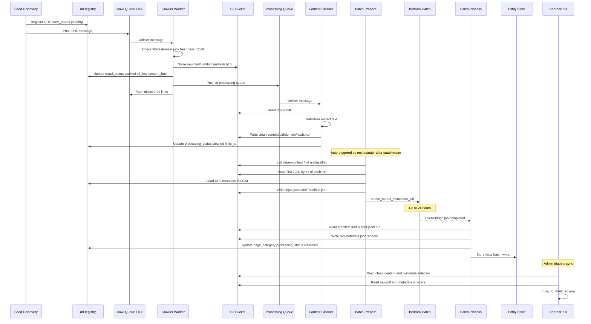
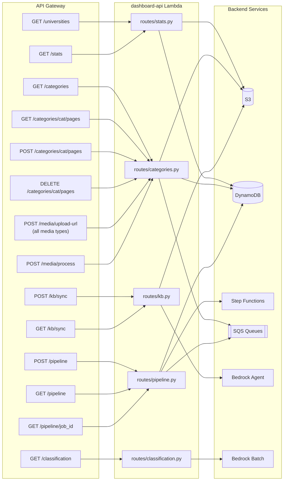
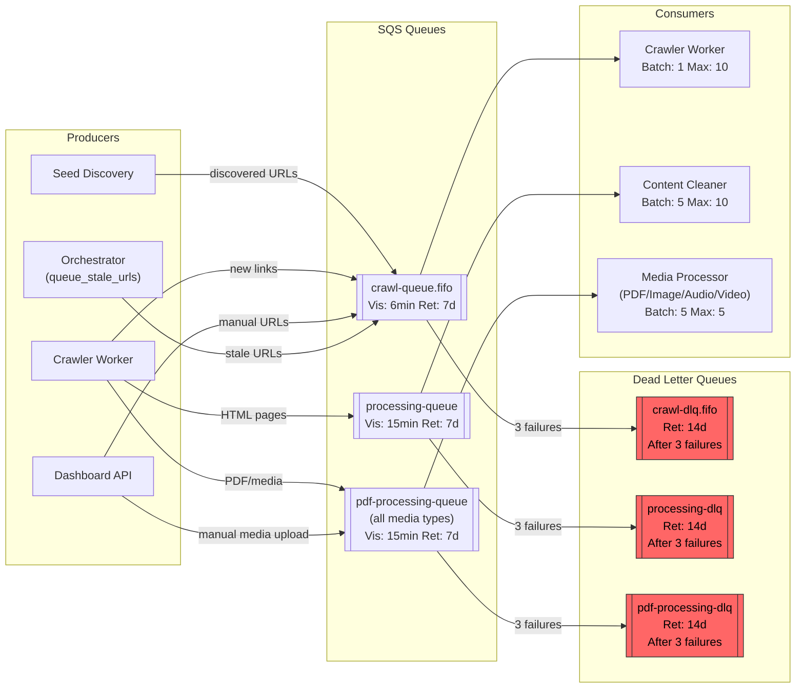
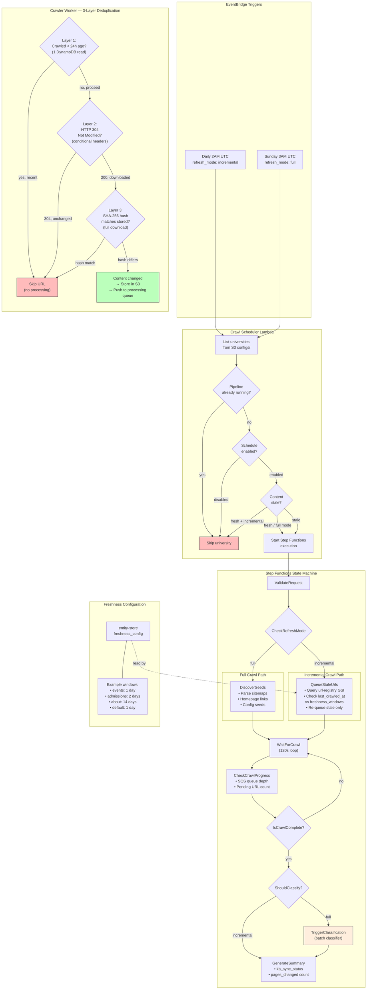

# Architecture Diagrams — University KB Crawler

## 1. Complete System Architecture

```
title University Knowledge Base Crawl Pipeline

// ▸ Detail: v2 Group A — Scheduling & Triggers
// Triggers
Triggers [icon: zap] {
  Daily Schedule [icon: aws-eventbridge, label: "EventBridge Daily 2AM UTC\n(incremental)"]
  Weekly Schedule [icon: aws-eventbridge, label: "EventBridge Sunday 3AM UTC\n(full)"]
  Refresh API [icon: aws-api-gateway, label: "POST /crawl/refresh"]
  Dashboard API [icon: aws-api-gateway, label: "Dashboard API"]
}

// Crawl Scheduler (pre-filter per university)
Crawl Scheduler [icon: aws-lambda, label: "crawl-scheduler\nPer-university checks:\n• Pipeline running?\n• Schedule enabled?\n• Content stale?", color: yellow]

// ▸ Detail: v2 Group B — State Machine Orchestration
// Step Functions Orchestrator
Orchestrator [icon: aws-step-functions, color: purple] {
  Validate Request [icon: check-circle]
  Check Mode [icon: git-branch, label: "CheckRefreshMode"]
  Discover Seeds [icon: search, label: "DiscoverSeeds\n(full crawl)"]
  Queue Stale URLs [icon: clock, label: "QueueStaleUrls\n(incremental)"]
  Wait for Crawl [icon: loader]
  Check Progress [icon: activity]
  Should Classify [icon: git-branch, label: "ShouldClassify\n(skip for incremental)"]
  Trigger Classification [icon: tag, label: "TriggerClassification\n(full only)"]
  Generate Summary [icon: file-text]
}

// ▸ Detail: v2 Group C — Crawl & 3-Layer Dedup
// Stage 2: Crawling
Crawling [icon: globe, color: blue] {
  Crawl Queue [icon: aws-sqs, label: "crawl-queue.fifo\nVis: 6min | Ret: 7d"]
  Crawler Worker [icon: aws-lambda, label: "crawler-worker\n3-layer dedup:\n1. Freshness (24h)\n2. HTTP 304\n3. SHA-256 hash"]
}

// ▸ Detail: v2 Group D — Content Processing
// Stage 3: Content Processing
Processing [icon: cpu, color: green] {
  Processing Queue [icon: aws-sqs, label: "processing-queue\nVis: 15min | Ret: 7d"]
  Media Queue [icon: aws-sqs, label: "pdf-processing-queue\n(all media types)\nVis: 15min | Ret: 7d"]
  Content Cleaner [icon: aws-lambda, label: "content-cleaner"]
  Media Processor [icon: aws-lambda, label: "pdf-processor\n(PDF/Image/Audio/Video)"]
}

// ▸ Detail: v2 Group G — SQS & DLQs
// Dead Letter Queues
DLQ [icon: alert-triangle, color: red] {
  Crawl DLQ [icon: aws-sqs, label: "crawl-dlq.fifo\n14d retention | After 3 failures"]
  Processing DLQ [icon: aws-sqs, label: "processing-dlq\n14d retention | After 3 failures"]
  Media DLQ [icon: aws-sqs, label: "pdf-processing-dlq\n14d retention | After 3 failures"]
}

// ▸ Detail: v2 Group E — Classification (full only)
// Stage 4: Batch Classification (full crawl only)
Classification [icon: tag, color: orange] {
  Batch Prepare [icon: aws-lambda, label: "batch-classifier-prepare"]
  Bedrock Batch [icon: aws-bedrock, label: "Claude 3 Haiku Batch"]
  Batch Complete Event [icon: aws-eventbridge, label: "Job Completion"]
  Batch Process [icon: aws-lambda, label: "batch-classifier-process"]
}

// ▸ Detail: v2 Group H — Storage Layer
// Storage
Storage [icon: database, color: gray] {
  S3 Bucket [icon: aws-s3, label: "university-kb-content"]
  URL Registry [icon: aws-dynamodb, label: "url-registry"]
  Entity Store [icon: aws-dynamodb, label: "entity-store\n(freshness_config,\nkb_sync_status)"]
  Robots Cache [icon: aws-dynamodb, label: "robots-cache"]
  Rate Limits [icon: aws-dynamodb, label: "crawl-rate-limits"]
  Pipeline Jobs [icon: aws-dynamodb, label: "pipeline-jobs"]
}

// Stage 5: Knowledge Base
Knowledge Base [icon: aws-bedrock, label: "Bedrock Knowledge Base"]

// ▸ Detail: v2 Group F — Dashboard & Manual Upload
// Dashboard
Dashboard Lambda [icon: aws-lambda, label: "dashboard-api"]

// Trigger connections (through scheduler)
Daily Schedule > Crawl Scheduler: incremental
Weekly Schedule > Crawl Scheduler: full
Crawl Scheduler > Orchestrator: start_execution (per eligible university)
Refresh API > Orchestrator: manual trigger (bypasses scheduler)
Dashboard API > Dashboard Lambda

// Orchestrator to Crawling
Discover Seeds > Crawl Queue: push URLs
Queue Stale URLs > Crawl Queue: push stale URLs

// Crawl stage flow
Crawl Queue > Crawler Worker
Crawler Worker > Crawl Queue: new links (full crawl)
Crawler Worker > Processing Queue: HTML
Crawler Worker > Media Queue: PDF/media
Crawler Worker > S3 Bucket: raw content
Crawler Worker <> URL Registry: status updates + dedup checks
Crawler Worker > Rate Limits: check rate
Crawler Worker > Robots Cache: check rules

// Processing stage flow
Processing Queue > Content Cleaner
Media Queue > Media Processor
Content Cleaner > S3 Bucket: clean .md
Content Cleaner > URL Registry: processing_status
Content Cleaner > Entity Store: pages_changed++ (incremental)
Media Processor > S3 Bucket: .metadata.json
Media Processor > URL Registry: processing_status

// Manual upload flow (Dashboard → S3 → Media Processor)
Dashboard Lambda > S3 Bucket: presigned upload (PDF/image/audio/video)
Dashboard Lambda > Media Queue: POST /media/process triggers SQS

// Classification stage flow (full crawl only)
Trigger Classification > Batch Prepare: invoke classification
Batch Prepare > S3 Bucket: input.jsonl
Batch Prepare > Bedrock Batch: submit job
Bedrock Batch > Batch Complete Event: completion
Batch Complete Event > Batch Process
Batch Process > S3 Bucket: read/write
Batch Process > URL Registry: page_category
Batch Process > Entity Store: facts

// Knowledge Base sync
Dashboard Lambda > Knowledge Base: start_ingestion_job
Knowledge Base > S3 Bucket: reads content

// Dashboard API connections
Dashboard Lambda <> URL Registry
Dashboard Lambda <> Pipeline Jobs
Dashboard Lambda <> S3 Bucket
Dashboard Lambda <> Entity Store
Dashboard Lambda > Orchestrator: start_execution

// DLQ connections
Crawl Queue --> Crawl DLQ: 3 failures
Processing Queue --> Processing DLQ: 3 failures
Media Queue --> Media DLQ: 3 failures

// Scheduler reads config
Crawl Scheduler > S3 Bucket: list configs/
Crawl Scheduler > Pipeline Jobs: check running jobs
Crawl Scheduler > Entity Store: freshness_config + schedule flags
```

---

## 2. Data Flow: Single URL Lifecycle



---

## 3. Step Functions State Machine

```mermaid
stateDiagram-v2
    [*] --> ValidateRequest
    ValidateRequest --> IsRequestValid
    ValidateRequest --> CrawlFailed: error

    IsRequestValid --> CheckRefreshMode: valid
    IsRequestValid --> CrawlFailed: invalid

    CheckRefreshMode --> DiscoverSeeds: full
    CheckRefreshMode --> QueueStaleUrls: incremental
    CheckRefreshMode --> DiscoverSeeds: default

    DiscoverSeeds --> WaitForCrawl
    DiscoverSeeds --> CrawlFailed: error
    QueueStaleUrls --> WaitForCrawl
    QueueStaleUrls --> CrawlFailed: error

    WaitForCrawl --> CheckCrawlProgress: 120s
    note right of CheckCrawlProgress: Checks crawl queue +\nprocessing queue +\npending URL count
    CheckCrawlProgress --> IsCrawlComplete
    CheckCrawlProgress --> CrawlFailed: error

    IsCrawlComplete --> WaitForCrawl: not complete
    IsCrawlComplete --> ShouldClassify: complete

    state ShouldClassify <<choice>>
    ShouldClassify --> GenerateSummary: incremental (skip classification)
    ShouldClassify --> TriggerClassification: full

    TriggerClassification --> GenerateSummary
    TriggerClassification --> GenerateSummary: error (non-fatal)
    GenerateSummary --> PipelineComplete
    note right of GenerateSummary: Writes kb_sync_status:\npending_sync (if pages changed)\nno_changes (if unchanged)
    PipelineComplete --> [*]
    CrawlFailed --> [*]
```

---

## 4. DynamoDB Table Relationships

```mermaid
erDiagram
    URL_REGISTRY {
        string url PK
        string url_hash
        string university_id
        string domain
        string crawl_status
        string page_category
        string subcategory
        string processing_status
        string content_type
        string content_hash
        int content_length
        string s3_key
        string last_crawled_at
        string classified_at
        string discovered_at
        int depth
        int retry_count
        string etag
        int ttl
    }

    ENTITY_STORE {
        string university_id PK
        string entity_key SK
        string entity_type
        string category
        string key
        string value
        string source_url
    }

    PIPELINE_JOBS {
        string job_id PK
        string university_id
        string created_at
        string refresh_mode
        string overall_status
        string execution_arn
        string crawl_stage
        string clean_stage
        string classify_stage
        int ttl
    }

    ROBOTS_CACHE {
        string domain PK
        string rules
        int ttl
    }

    RATE_LIMITS {
        string domain PK
        int tokens
        string last_refill
    }

    URL_REGISTRY ||--o{ ENTITY_STORE : "facts extracted from"
    URL_REGISTRY }o--|| PIPELINE_JOBS : "tracked by"
    URL_REGISTRY }o--|| ROBOTS_CACHE : "respects"
    URL_REGISTRY }o--|| RATE_LIMITS : "throttled by"
```

---

## 5. Dashboard API Routes



---

## 6. SQS Message Flow



---

## 7. Recrawl & Incremental Crawl Flow




### Recrawl Flow Summary

| Step | Incremental (daily) | Full (weekly) |
|------|---------------------|---------------|
| **Trigger** | EventBridge 2AM UTC | EventBridge Sunday 3AM UTC |
| **Scheduler checks** | Running? Enabled? Stale? | Running? Enabled? (always triggers) |
| **URL selection** | Only stale URLs (per category freshness window) | ALL crawled URLs + new seeds |
| **Crawler dedup** | 3-layer (freshness → HTTP 304 → hash) | 3-layer (same) |
| **Classification** | Skipped (existing categories preserved) | Full batch classification |
| **Metadata sidecar** | Preserved (not deleted) | Re-created with new category |
| **KB sync** | Manual (admin notified if pages changed) | Manual (admin notified) |
| **Pipeline status** | `classify_stage = "skipped"` | `classify_stage = "completed"` |
